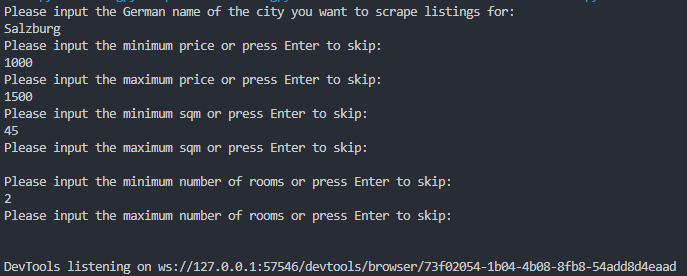

<!-- Improved compatibility of back to top link: See: https://github.com/othneildrew/Best-README-Template/pull/73 -->
<a name="readme-top"></a>
<!--
*** Thanks for checking out the Best-README-Template. If you have a suggestion
*** that would make this better, please fork the repo and create a pull request
*** or simply open an issue with the tag "enhancement".
*** Don't forget to give the project a star!
*** Thanks again! Now go create something AMAZING! :D
-->


<!-- PROJECT SHIELDS -->
<!--
*** I'm using markdown "reference style" links for readability.
*** Reference links are enclosed in brackets [ ] instead of parentheses ( ).
*** See the bottom of this document for the declaration of the reference variables
*** for contributors-url, forks-url, etc. This is an optional, concise syntax you may use.
*** https://www.markdownguide.org/basic-syntax/#reference-style-links
-->
[![Forks][forks-shield]][forks-url]
[![Stargazers][stars-shield]][stars-url]
[![Issues][issues-shield]][issues-url]
[![LinkedIn][linkedin-shield]][linkedin-url]


<!-- PROJECT LOGO -->
<br />
<div align="center">
  <a href="https://github.com/yeniuma/ImmoData">
    
  </a>

<h3 align="center">ImmoData</h3>

  <p align="center">
    Effortlessly streamline your apartment hunting on ImmoScout24 with this lightweight Python scraper. Fetch detailed property listings, customize searches, and gain valuable insights through data analysis. Save time, make informed decisions, and find your dream home faster. Happy hunting!
    <br />
    <a href="https://github.com/yeniuma/ImmoData"><strong>Explore the docs »</strong></a>
    <br />
    <br />
    <a href="https://github.com/yeniuma/ImmoData">View Demo</a>
    ·
    <a href="https://github.com/yeniuma/ImmoData/issues">Report Bug</a>
    ·
    <a href="https://github.com/yeniuma/ImmoData/issues">Request Feature</a>
  </p>
</div>


<!-- TABLE OF CONTENTS -->
<details>
  <summary>Table of Contents</summary>
  <ol>
    <li>
      <a href="#about-the-project">About ImmoData</a>
      <ul>
        <li><a href="#built-with">Built With</a></li>
      </ul>
    </li>
    <li>
      <a href="#getting-started">Getting Started</a>
      <ul>
        <li><a href="#installation">Installation</a></li>
      </ul>
    </li>
    <li><a href="#usage">Usage</a></li>
    <li><a href="#contributing">Contributing</a></li>
    <li><a href="#contact">Contact</a></li>
  </ol>
</details>


<!-- ABOUT THE PROJECT -->
## About ImmoData
<p align="center"></p>

The main idea behind this project came from a need: I wanted to make some viz which would help us look for suitable apartments. The issue came when I realized, that there is no public API available for any of the Austrian rental websites, so I had to get creative and find a workaround to gather the data. 
Although the dashboard is in progress, the scraping script is totally ready to use.

<p align="right">(<a href="#readme-top">Back to top</a>)</p>


### Built With

* [![Python][Python]][Python-url]
* [![Selenium][Selenium]][Selenium-url]
* [![Streamlit][Streamlit]][Streamlit-url]

<p align="right">(<a href="#readme-top">Back to top</a>)</p>


<!-- GETTING STARTED -->
## Getting Started


### Installation

1. Clone the repository
   ```sh
   git clone https://github.com/yeniuma/ImmoData.git
   ```

   After cloning repository:
    - create 'model' folder in ImmoData
    - download speech recognizer model from https://alphacephei.com/vosk/models/vosk-model-de-0.21.zip
    - unpack zip into 'model'

2. Install packages
   ```sh
   pip install -r requirements.txt
   ```
3. Run main.py
   ```sh
   python main.py
   ```

<p align="right">(<a href="#readme-top">Back to top</a>)</p>


<!-- USAGE EXAMPLES -->
## Usage

After firing up the script with `main.py`, you only need to enter the text for the parameters you want to use. The `.csv` outputs will be written in the `exports` folder on a page-by-page basis.

<p align="left"></p>

<p align="right">(<a href="#readme-top">Back to top</a>)</p>


<!-- ROADMAP -->
<!-- ## Roadmap

- [ ] Feature 1
- [ ] Feature 2
- [ ] Feature 3
    - [ ] Nested Feature

See the [open issues](https://github.com/yeniuma/ImmoData/issues) for a full list of proposed features (and known issues).

<p align="right">(<a href="#readme-top">Back to top</a>)</p> -->


<!-- CONTRIBUTING -->
## Contributing

Contributions are what make the open source community such an amazing place to learn, inspire, and create. Any contributions you make are **greatly appreciated**.

If you have a suggestion that would make this better, please fork the repo and create a pull request. You can also simply open an issue with the tag "enhancement".
Don't forget to give the project a star! Thanks again!

1. Fork the Project
2. Create your Feature Branch (`git checkout -b feature/AmazingFeature`)
3. Commit your Changes (`git commit -m 'Add some AmazingFeature'`)
4. Push to the Branch (`git push origin feature/AmazingFeature`)
5. Open a Pull Request

<p align="right">(<a href="#readme-top">Back to top</a>)</p>


<!-- CONTACT -->
## Contact

manczaladri@gmail.com

Project Link: [https://github.com/yeniuma/ImmoData](https://github.com/yeniuma/ImmoData)

<p align="right">(<a href="#readme-top">Back to top</a>)</p>


<!-- MARKDOWN LINKS & IMAGES -->
<!-- https://www.markdownguide.org/basic-syntax/#reference-style-links -->
[contributors-shield]: https://img.shields.io/github/contributors/yeniuma/ImmoData.svg?style=for-the-badge
[contributors-url]: https://github.com/yeniuma/ImmoData/graphs/contributors
[forks-shield]: https://img.shields.io/github/forks/yeniuma/ImmoData.svg?style=for-the-badge
[forks-url]: https://github.com/yeniuma/ImmoData/network/members
[stars-shield]: https://img.shields.io/github/stars/yeniuma/ImmoData.svg?style=for-the-badge
[stars-url]: https://github.com/yeniuma/ImmoData/stargazers
[issues-shield]: https://img.shields.io/github/issues/yeniuma/ImmoData.svg?style=for-the-badge
[issues-url]: https://github.com/yeniuma/ImmoData/issues
[linkedin-shield]: https://img.shields.io/badge/-LinkedIn-black.svg?style=for-the-badge&logo=linkedin&colorB=555
[linkedin-url]: https://www.linkedin.com/in/adrienn-manczal/
[Python]: https://img.shields.io/badge/python-3670A0?style=for-the-badge&logo=python&logoColor=ffdd54
[Python-url]: https://www.python.org/
[Selenium]: https://img.shields.io/badge/selenium-43B02A.svg?&style=for-the-badge&logo=selenium&logoColor=white
[Selenium-url]: https://www.selenium.dev/
[Streamlit]: https://img.shields.io/badge/streamlit-FF4B4B.svg?&style=for-the-badge&logo=streamlit&logoColor=white
[Streamlit-url]: https://streamlit.io/
